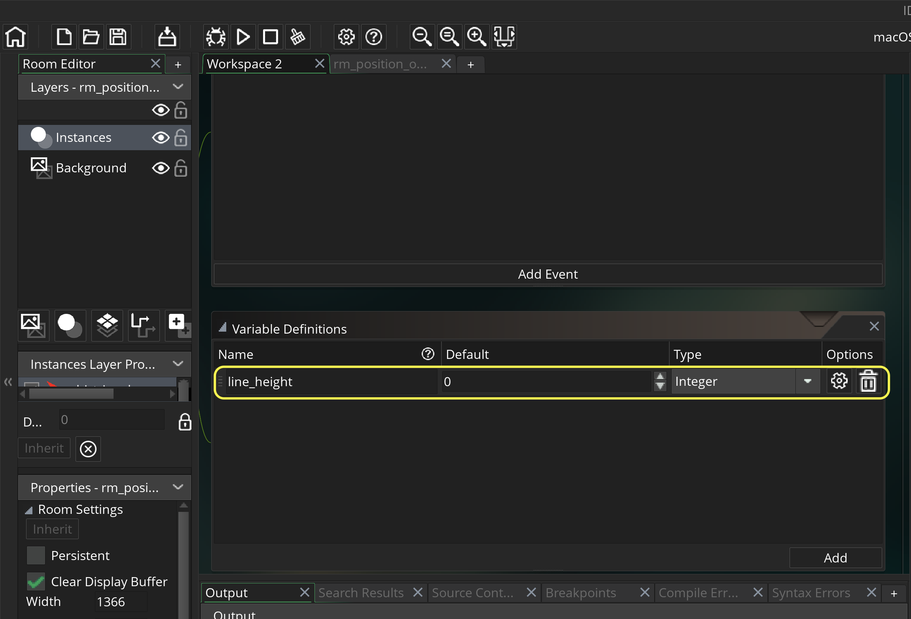

### Screen Positioning II

[previous](../positioning-text-1/README.md#user-content-screen-positioning-i) • [home](../README.md#user-content-gms2-screen-positioning) • [next](../)

Lets take a closer look at how we position text, objects and other items on screen.

 

---

##### `Step 1.`\|`MTP`|:small_blue_diamond:

Repeat this one last time for a sprite called `spr_circle`.  Press **Edit Sprite** and select the *green* color and the bottom right of the **Draw Circle** tool and draw a nice green circle.  Make sure it fills the entire 64 b6 64 frame and is symmetrial in all four corners.

##### `Step 2.`\|`FHIU`|:small_blue_diamond: :small_blue_diamond: 

We can't place a sprite in the room we have to bind it to an game object. *Right click* on **Object** and select **Create | Object**.  Call this object `obj_triangle`.  Press the button that says <kbd>No Sprite</kbd> and pick the `spr_triangle` **sprite** from the drop down menu.

##### `Step 3.`\|`MTP`|:small_blue_diamond: :small_blue_diamond: :small_blue_diamond:

Now lets create an object for the square. *Right click* on **Object** and select **Create | Object**.  *Call* this object `obj_square`.  Press the button that says <kbd>No Sprite</kbd> and pick the `spr_square` sprite from the drop down menu.

##### `Step 4.`\|`MTP`|:small_blue_diamond: :small_blue_diamond: :small_blue_diamond: :small_blue_diamond:

Now lets create an object for the circle. *Right click* on *Object* and select **Create | Object**.  Call this object `obj_circle`.  *Press* the button that says <kbd>No Sprite</kbd> and pick the `spr_circle` sprite from the drop down menu.

##### `Step 5.`\|`MTP`| :small_orange_diamond:

Please note a consistency here.  We are naming all objects with prefix obj_ and all sprites spr_.  This is because we can't have two files with the same name.  We might have various different types of assets with the name circle (for example). This allows us to share a name but not have a problem with collision on two game items with the exact same name.  It also makes it easier to figure out which sprite goes with which objects.  In a small object like this it is simple, but if we had 200 sprites and objects this would be harder to tell without following a consistent naming convention.

*Double left click* **rm_position_objects]** and drag the triangle, circle and square into the room around where you think line 25 lies by eye.

##### `Step 6.`\|`MTP`| :small_orange_diamond: :small_blue_diamond:

Now *press* the <kbd>Play</kbd> button in the top menu bar to launch the game. We should see the three shapes and through trial and error want them to be on the center of the line.

##### `Step 7.`\|`MTP`| :small_orange_diamond: :small_blue_diamond: :small_blue_diamond:

*Double left click* **obj_triangle** and we need to add a variable to this object.  *Press* the **Variable Definition** button on the game object. 

##### `Step 8.`\|`MTP`| :small_orange_diamond: :small_blue_diamond: :small_blue_diamond: :small_blue_diamond:

Press the <kbd>Add</kbd> button and call the variable `line_height` and set the **Default** value to `22`.  Make sure the **Type** is a `Integer`.

##### `Step 9.`\|`MTP`| :small_orange_diamond: :small_blue_diamond: :small_blue_diamond: :small_blue_diamond: :small_blue_diamond:

GameMaker uses an **[event system](https://manual.yoyogames.com/The_Asset_Editors/Object_Properties/Object_Events.htm)** to run its scripts. We have already used the **Draw** event to draw the text and lines in this room.  The draw event runs every frame.

We will take a look at two more event types: **Create Events** & **Step Events**

The **[Create Event](https://manual.yoyogames.com/The_Asset_Editors/Object_Properties/Object_Events.htm)** runs only one time when the object is instantiated (when it appears in the room). This could be at the game start if the object is placed in the Room; or it could be run once when it is instantiated through code. This is the perfect time to set up the inital value for a variable. Please note that this will be shared amongst all instances, if you want a separate value for a specific instance use the editor in the room to adjust the variable value.  The room settings run after the Create Event and will override what is placed there.

The **[Step Event](https://manual.yoyogames.com/The_Asset_Editors/Object_Properties/Object_Events.htm)** is the main game loop. It runs every frame when the game is running. The code attached to this event runs every tick. Typically we instantiate variables in the Create event and run ai and gameplay in the step event. The step event (like the draw event) runs every frame so be careful to use it for something that needs to be updated 30+ times a second. 

##### `Step 10.`\|`MTP`| :large_blue_diamond:

For positioning the objects in the room we will use the create event.  We only need to do this once and there is only a single instance of each object (don't need to do it in the room).  
	
*Double click* on **obj_triangle** and press the <kbd>Events</kbd> button then press the <kbd>AddEvent button</kbd> .  In the menu select `Create` event. *Scroll* over to the scripting window that flew out. 

##### `Step 11.`\|`MTP`| :large_blue_diamond: :small_blue_diamond: 

##### `Step 12.`\|`MTP`| :large_blue_diamond: :small_blue_diamond: :small_blue_diamond: 

##### `Step 13.`\|`MTP`| :large_blue_diamond: :small_blue_diamond: :small_blue_diamond:  :small_blue_diamond: 

##### `Step 14.`\|`MTP`| :large_blue_diamond: :small_blue_diamond: :small_blue_diamond: :small_blue_diamond:  :small_blue_diamond: 

##### `Step 15.`\|`MTP`| :large_blue_diamond: :small_orange_diamond: 

##### `Step 16.`\|`MTP`| :large_blue_diamond: :small_orange_diamond:   :small_blue_diamond: 

##### `Step 17.`\|`MTP`| :large_blue_diamond: :small_orange_diamond: :small_blue_diamond: :small_blue_diamond:

##### `Step 18.`\|`MTP`| :large_blue_diamond: :small_orange_diamond: :small_blue_diamond: :small_blue_diamond: :small_blue_diamond:

##### `Step 19.`\|`MTP`| :large_blue_diamond: :small_orange_diamond: :small_blue_diamond: :small_blue_diamond: :small_blue_diamond: :small_blue_diamond:

##### `Step 20.`\|`MTP`| :large_blue_diamond: :large_blue_diamond:

##### `Step 21.`\|`MTP`| :large_blue_diamond: :large_blue_diamond: :small_blue_diamond:

___

|[previous](../positioning-text-1/README.md#user-content-screen-positioning-i)| [home](../README.md#user-content-gms2-screen-positioning) | [next](../)|
|---|---|---|

