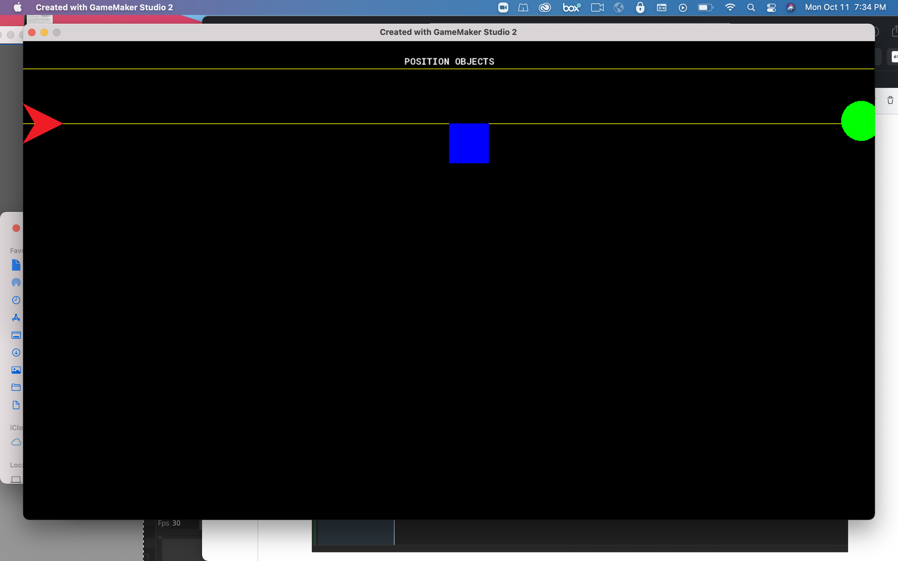

### Screen Positioning III

[previous](../positioning-text-2/README.md#user-content-screen-positioning-ii) • [home](../README.md#user-content-gms2-screen-positioning) • [next](../)

Lets take a closer look at how we position text, objects and other items on screen.

 

---

##### `Step 1.`\|`MTP`|:small_blue_diamond:

Press the <kbd>Add Event</kbd> button and select a **Create** event.

##### `Step 2.`\|`FHIU`|:small_blue_diamond: :small_blue_diamond: 

In this case we want the middle of the room and we can divide the `room_width` variable by `2` (or multiply by `0.5`). The **y** value will be the same as `obj_square`.

##### `Step 3.`\|`MTP`|:small_blue_diamond: :small_blue_diamond: :small_blue_diamond:

Now *press* the <kbd>Play</kbd> button in the top menu bar to launch the game. We notice that it has the same problem that it is positioned based on it's top left corner.

##### `Step 4.`\|`MTP`|:small_blue_diamond: :small_blue_diamond: :small_blue_diamond: :small_blue_diamond:

Now there are other reason's besides positioning the sprite to adjust the origin.  Another consideration is when we want to rotate the sprite.  

We will be using a different event type to rotate the object.  Since this is not just happening on one frame we need to rotate it every frame.  This is the perfect time to use our second event type a Step event.  Press the <kbd>Add Event</kbd> button and select **Step | Steps** from the menu.

##### `Step 5.`\|`MTP`| :small_orange_diamond:

To rotate the player there is a variable that is used to determine the angle the player is facing at.  The variable is called **[image_angle](https://manual.yoyogames.com/GameMaker_Language/GML_Reference/Asset_Management/Sprites/Sprite_Instance_Variables/image_angle.htm)**.

`image_angle` is set by changing its angle in degrees.	To rotate counter-clockwise we add degrees *positively* then we rotate clockwise by *subtracting* degrees.  You can see below that a round trip is 360 degrees.

##### `Step 6.`\|`MTP`| :small_orange_diamond: :small_blue_diamond:

We will start by rotating counter-clockwise.  We will add 5 degrees every frame.  The level defaults to 30 frames a second so it will be rotating 5 * 30 = 150 degrees per second. To alter the `image_angle` variable we will add 5 degrees to itself.  So it starts at 0, goes to 5 in the second frame, 10 in the third frame, 15 in the fourth frame etc...

##### `Step 7.`\|`MTP`| :small_orange_diamond: :small_blue_diamond: :small_blue_diamond:

Now *press* the <kbd>Play</kbd> button in the top menu bar to launch the game. Notice that the axis the sprite rotates around is its origin.  This is at the top left corner.  

##### `Step 8.`\|`MTP`| :small_orange_diamond: :small_blue_diamond: :small_blue_diamond: :small_blue_diamond:

Now lets prove that changing the origin will alter the point of rotation.  If this is the case the triangle should rotate on its center.  Lets *add* a **Step | Step** event to `obj_triangle` by pressing the **Add Event** button.

##### `Step 9.`\|`MTP`| :small_orange_diamond: :small_blue_diamond: :small_blue_diamond: :small_blue_diamond: :small_blue_diamond:

Lets rotate the triangle clockwise so we will subtract by 5 each frame. So it starts at 0, goes to -5 in the second frame, -10 in the third frame, -15 in the fourth frame etc... Add the following script to obj_triangle.

##### `Step 10.`\|`MTP`| :large_blue_diamond:

Now *press* the <kbd>Play</kbd> button in the top menu bar to launch the game. Notice that the triangle rotates on the axis whose origin is centered horizontally and vertically wihin the sprite:

##### `Step 11.`\|`MTP`| :large_blue_diamond: :small_blue_diamond: 

##### `Step 12.`\|`MTP`| :large_blue_diamond: :small_blue_diamond: :small_blue_diamond: 

##### `Step 13.`\|`MTP`| :large_blue_diamond: :small_blue_diamond: :small_blue_diamond:  :small_blue_diamond: 

##### `Step 14.`\|`MTP`| :large_blue_diamond: :small_blue_diamond: :small_blue_diamond: :small_blue_diamond:  :small_blue_diamond: 

##### `Step 15.`\|`MTP`| :large_blue_diamond: :small_orange_diamond: 

##### `Step 16.`\|`MTP`| :large_blue_diamond: :small_orange_diamond:   :small_blue_diamond: 

##### `Step 17.`\|`MTP`| :large_blue_diamond: :small_orange_diamond: :small_blue_diamond: :small_blue_diamond:

##### `Step 18.`\|`MTP`| :large_blue_diamond: :small_orange_diamond: :small_blue_diamond: :small_blue_diamond: :small_blue_diamond:

##### `Step 19.`\|`MTP`| :large_blue_diamond: :small_orange_diamond: :small_blue_diamond: :small_blue_diamond: :small_blue_diamond: :small_blue_diamond:

##### `Step 20.`\|`MTP`| :large_blue_diamond: :large_blue_diamond:

##### `Step 21.`\|`MTP`| :large_blue_diamond: :large_blue_diamond: :small_blue_diamond:

___

|[previous](../positioning-text-2/README.md#user-content-screen-positioning-ii)| [home](../README.md#user-content-gms2-screen-positioning) | [next](../)|
|---|---|---|

